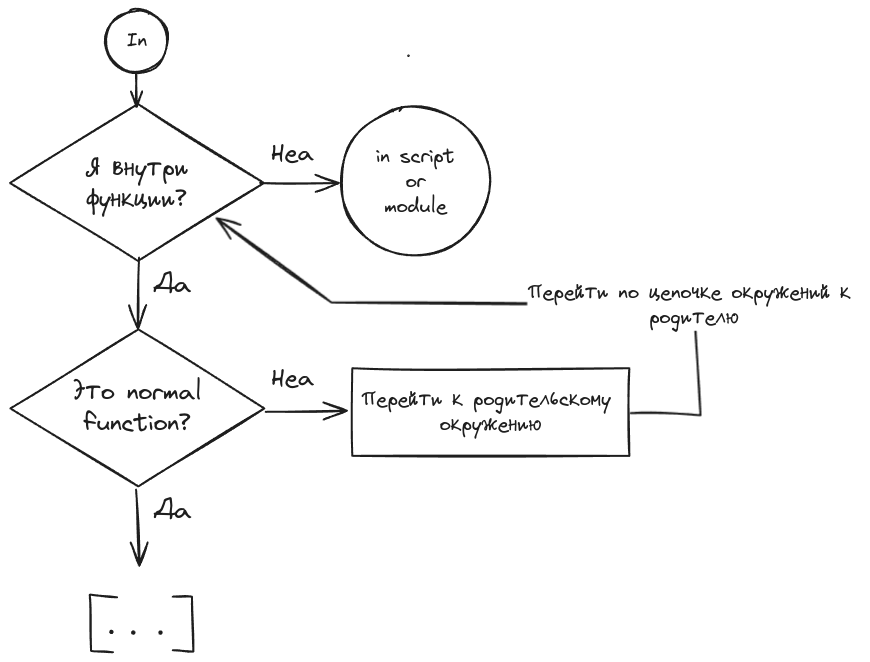
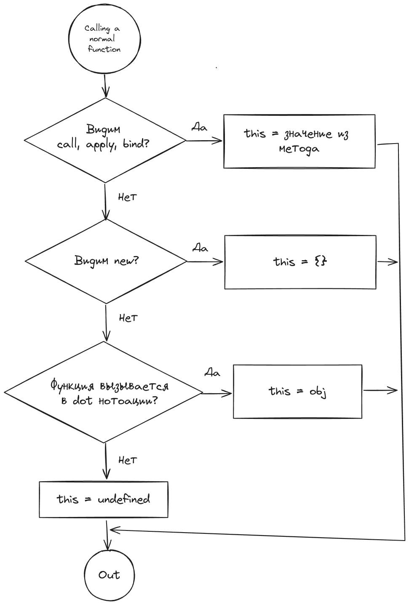

# This

`this` - это **не контекст**, как в других языках.

`this` - это особый аргумент нормальной функции (не стрелочной). Любая нормальная функция вызывается минимум с 1 аргументом - `this`.

Чему равен `this` зависит от того КАК и КАКАЯ функция запускается.

## Кратко

1. Если находится не внутри кода функции, то важно находимся мы в script или module (малополезный случай)
2. Если внутри module: `this = undefined`
3. Если внутри script: this может быть любым. Задаёт host.
4. Только **вызов функции** изменяет `this`. Кроме arrow function.
5. Любая нормальная функция всегда имеет минимум 1 аргумент - `this`. Он есть всегда. И этот аргумент всегда связывается с каким-то значением, **при вызове** функции.

## This и Global Environment

Самый простой (и бесполезный) случай, когда `this` находится в глобальном окружении.

```js
'use strict';

console.log('This is:', this); // undefined, global object или то, что установит host
```


## Arrow Function Environment

Если `this` находится внутри arrow function, то чтобы понять, чему он равен, нужно пройти по цепочке окружений и найти, где `this` был задан. Arrow function никак не меняет `this`.

```js
'use strict';

function logThis() {
  var arrowFunc = () => console.log('this is:', this);

  arrowFunc();
}

// 1. arrow function не влияет на this
// 2. Родительское окружение arrow function - normal function logThis
// 3. Как вызывается logThis ?
// 4. Без call, apply, bind, new, не в dot нотации -> this = undefined
logThis(); // this is: undefined
```



## Normal Function Environment

Надо посмотреть, как эта функция вызывается!

Если аргумент `this` не задан, то по умолчанию он связан с `undefined`

```js
'use strict';

function logThis() {
  console.log('this is:', this);
}

// 1. this внутри normal function
// 2. Как вызывается logThis ?
// 3. Без call, apply, bind, new, не в dot нотации -> this = undefined
logThis(); // this is: undefined
```


### This и call, apply, bind

Методы явно задают `this` для вызываемой функции.

```js
'use strict';

function logThis() {
  console.log('this is:', this);
}

var thisArg = { name: 'User' };
logThis.call(thisArg); // this is: { name: 'User' }
logThis.apply(thisArg); // this is: { name: 'User' }
logThis.bind(thisArg)(); // this is: { name: 'User' }

thisArg = 42;
logThis.call(thisArg); // this is: 42
logThis.apply(thisArg); // this is: 42
logThis.bind(thisArg)(); // this is: 42
```


### This и new

Ключевое слово `new` вызывает функцию (кроме стрелочных) и связывает `this` с пустым объектом `{}`.

```js
'use strict';

function logThis() {
  console.log('this is:', this);
}

new logThis(); // this is: logThis {}

// new принудительно вызывает функцию, можно не указывать () для вызова функции.
// prettier-ignore
new logThis; // this is: logThis {}
```

### This и dot нотация

Dot нотация в JS - это синтаксис, когда два идентификатора разделены между собой точкой:

```js
obj.property;
obj['property']; // аналог
```

Вызов функции в dot нотации:

```js
obj.func();
obj['func'](); // аналог
```

При вызове функции в dot нотации `this` будет равняться тому идентификатору, который стоит перед точкой. В примере ниже - это `obj`

```js
'use strict';

function logThis() {
  console.log('this is:', this);
}

var obj = { name: 'User' };

obj.logThis = logThis;

obj.logThis(); // this is: { name: 'User', logThis }
```



Ещё пример:

```js
'use strict';

var obj = {
  name: 'User',
  logThis() {
    console.log('this is:', this);
  },
};

// Связали метод из объекта obj с идентификатором logThisGlobal
var logThisGlobal = obj.logThis;

// Потому что функция не вызывается в dot нотации
logThisGlobal(); // this is: undefind

// Функция-метод вызывается в dot нотации
obj.logThis(); // this is: { name: 'User', logThis }
```

### Внешние API

Внешние API как хотят меняют `this`!

```js
'use strict';

var obj = {
  name: 'User',
  logThis() {
    console.log('this is:', this);
  },
};

// setTimeout - внешнее API. Оно задаёт this по своей спецификации
setTimeout(obj.logThis, 1); // объект Window {...} в браузере
```

В случай addEventListener `this` будет связан с элементом, на котором висит слушатель события.

[live demo](./static/index.html)

```js
'use strict';

function handleClick() {
  console.log('this is:', this);
}

// this должен быть undefined по спецификации EcmaScript
// Но будет ссылкться на body - элемент на котором висит слушатель
document.body.addEventListener('click', handleClick);

// this будет { value: 42 }, потому что мы явно это задали
document.body.addEventListener('click', handleClick.bind({ value: 42 }));
```
