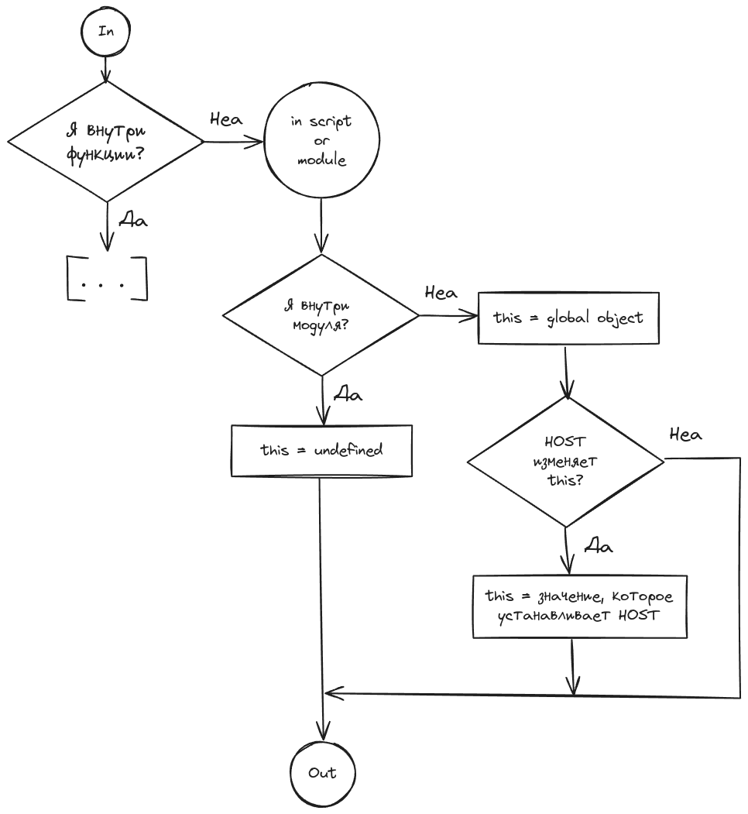
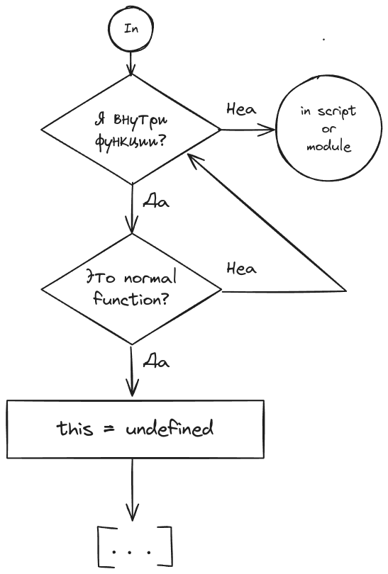
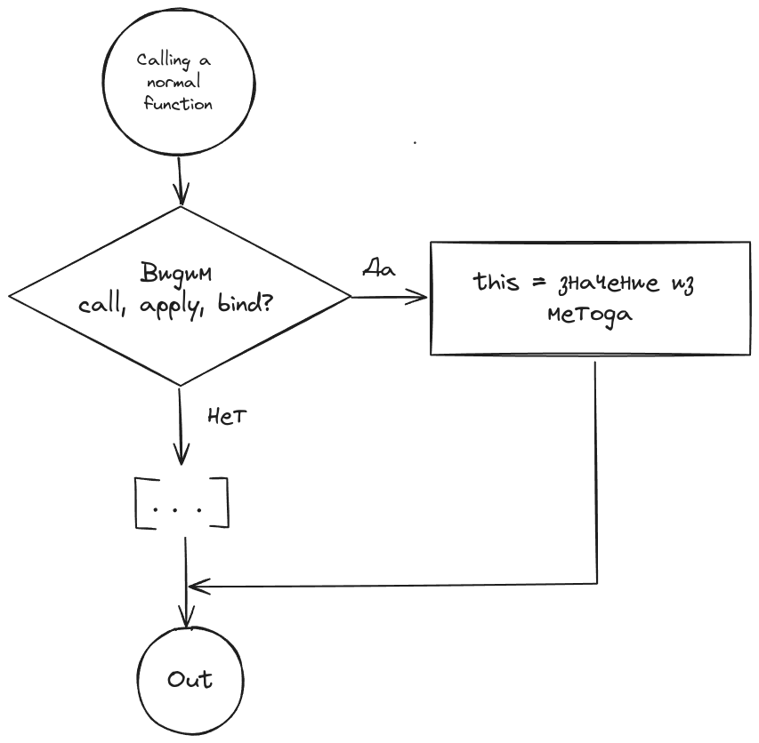

# This

`this` - это **не контекст**, как в других языках.

`this` в JS - это особый идентификатор, который определён локально для всех normal functions (не стрелочных). По умолчанию задан как `undefined` для strict mode или как `global object` для non strict mode. Связать значение с `this` можно только особой формой вызова normal function.

Значение `this` для normal function может быть изменено **только в момент вызова** этой функции и зависит от формы/способоа её вызова

Любая нормальная функция вызывается минимум с 1 аргументом - `this`. Он есть всегда. Этот аргумент всегда связывается с каким-то значением, **при вызове** функции. Задать `this` напрямую при вызове функции нельзя.

## Коротко

1. Вызов любой normal function по умолчанию связывает `this` с `undefined`
2. Вызов normal function с ключевым словом `new` свяжет `this` с пустым объектом `{}`
3. Можно явно задать `this` с помощью `call`, `apply`, `bind`
   ```js
   func.call(thisArg, ...args);
   func.apply(thisArg, ...args);
   func.bind(thisArg, ...args)();
   ```
4. Если normal function вызфывается в dot нотакции, то `this` будет связан со значением идентификатора, который стоит перед точкой
5. Внешние API как угодно меняют значение `this`. Но! только в случае, если это normal function для которой `this` не задан специально с помощью `call`, `apply`, `bind`

## This и Global Environment

Самый простой (и бесполезный) случай, когда `this` находится в глобальном окружении.

```js
'use strict';

console.log('This is:', this); // undefined, global object или то, что установит host
```



## Arrow Function Environment

Если `this` находится внутри arrow function, то чтобы понять, чему он равен, нужно пройти по цепочке окружений и найти, где `this` был задан. Arrow function никак не меняет `this`.

```js
'use strict';

function logThis() {
  var arrowFunc = () => console.log('this is:', this);

  arrowFunc();
}

// 1. arrow function не влияет на this
// 2. Родительское окружение arrow function - normal function logThis
// 3. Как вызывается logThis ?
// 4. Без call, apply, bind, new, не в dot нотации -> this = undefined
logThis(); // this is: undefined
```

```js
'use strict';

// this внутри стрелочной функции. Нужно перейти в родительское окружение
// Родительское окружение - где функци рождена = определена
// Родительское окружение в данном случае - глобальное.
// Для модуля будет undefined
// Для скрипта будет global object.
var arrowFunc = () => console.log('this is:', this);

function logThis() {
  arrowFunc();
}

logThis(); // this is: global object, Window в браузере
```

```js
'use strict';

var arrowFunc = () => console.log('this is:', this);

var obj = {
  name: 'User',
  sayName() {
    arrowFunc();
  },
};

// Теже самые рассуждения, что и в примере выше
obj.sayName(); // this is: global object
```

```js
'use strict';

var arrowFunc = () => console.log('this is:', this);

var obj = {
  name: 'User',
  sayName: function () {
    var arrowFunc = () => console.log('this is:', this);
    arrowFunc();
  },
};

// this внутри стрелочнйо функции
// идём в родительское окружение. Это normal function
// как эта функция вызывается? Через дот нотацию
// this связан с объектом obj
obj.sayName(); // this is: { name: 'User', sayName }
```

```js
'use strict';

var obj = {
  name: 'User',
  returnFunc: function () {
    var arrowFunc = () => console.log('this is:', this);
    return arrowFunc;
  },
};

var superObj = {
  name: 'Super User',
  sayName: function (func) {
    func();
  },
};

// this внутри стрелочнйо функции
// идём в родительское окружение. Это normal function
// как эта функция вызывается? Через дот нотацию
// this связан с объектом obj
superObj.sayName(obj.returnFunc()); // { name: 'User', returnFunc }
```


## Normal Function Environment

Надо посмотреть, как эта функция вызывается!

Если аргумент `this` не задан, то по умолчанию он связан с `undefined`

```js
'use strict';

function logThis() {
  console.log('this is:', this);
}

// 1. this внутри normal function
// 2. Как вызывается logThis ?
// 3. Без call, apply, bind, new, не в dot нотации -> this = undefined
logThis(); // this is: undefined
```



### This и call, apply, bind

Методы явно задают `this` для вызываемой функции.

```js
'use strict';

function logThis() {
  console.log('this is:', this);
}

var thisArg = { name: 'User' };
logThis.call(thisArg); // this is: { name: 'User' }
logThis.apply(thisArg); // this is: { name: 'User' }
logThis.bind(thisArg)(); // this is: { name: 'User' }

thisArg = 42;
logThis.call(thisArg); // this is: 42
logThis.apply(thisArg); // this is: 42
logThis.bind(thisArg)(); // this is: 42
```



### This и new

Ключевое слово `new` вызывает функцию (кроме стрелочных) и связывает `this` с пустым объектом `{}`.

```js
'use strict';

function logThis() {
  console.log('this is:', this);
}

new logThis(); // this is: logThis {}

// new принудительно вызывает функцию, можно не указывать () для вызова функции.
// prettier-ignore
new logThis; // this is: logThis {}
```

### This и dot нотация

Dot нотация в JS - это синтаксис, когда два идентификатора разделены между собой точкой:

```js
obj.property;
obj['property']; // аналог
```

Вызов функции в dot нотации:

```js
obj.func();
obj['func'](); // аналог
```

При вызове функции в dot нотации `this` будет равняться тому идентификатору, который стоит перед точкой. В примере ниже - это `obj`

```js
'use strict';

function logThis() {
  console.log('this is:', this);
}

var obj = { name: 'User' };

obj.logThis = logThis;

obj.logThis(); // this is: { name: 'User', logThis }
```


Ещё пример:

```js
'use strict';

var obj = {
  name: 'User',
  logThis() {
    console.log('this is:', this);
  },
};

// Связали метод из объекта obj с идентификатором logThisGlobal
var logThisGlobal = obj.logThis;

// Потому что функция не вызывается в dot нотации
logThisGlobal(); // this is: undefind

// Функция-метод вызывается в dot нотации
obj.logThis(); // this is: { name: 'User', logThis }
```

### Внешние API

Внешнее API может как хочет менять `this`, но только если это normal function, для которой `this` не был установлен принудительно.

```js
'use strict';

var obj = {
  name: 'User',
  logThis() {
    console.log('this is:', this);
  },
};

// setTimeout - внешнее API. Оно задаёт this по своей спецификации
// В случае бразера - это спецификация html5. В режиме модуль это undefined, в режиме скрипта - глобальный объект - window
setTimeout(obj.logThis, 1);
```

В случай addEventListener `this` будет связан с элементом, на котором висит слушатель события.

[live demo](./static/index.html)

```js
'use strict';

function handleClick() {
  console.log('this is:', this);
}

// this должен быть undefined по спецификации EcmaScript
// Но будет ссылкться на body - элемент на котором висит слушатель
document.body.addEventListener('click', handleClick);

// this будет { value: 42 }, потому что мы явно это задали
document.body.addEventListener('click', handleClick.bind({ value: 42 }));
```
